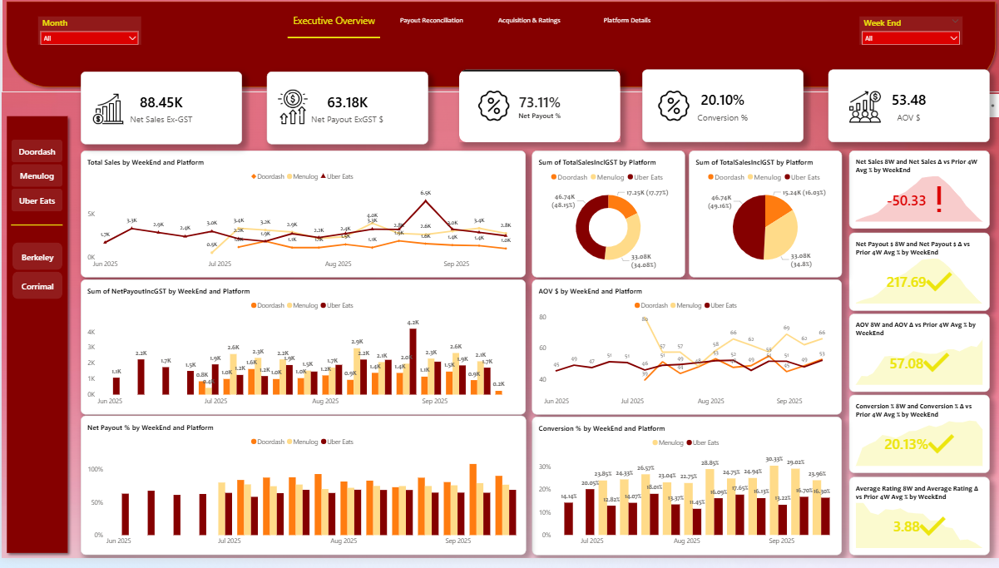
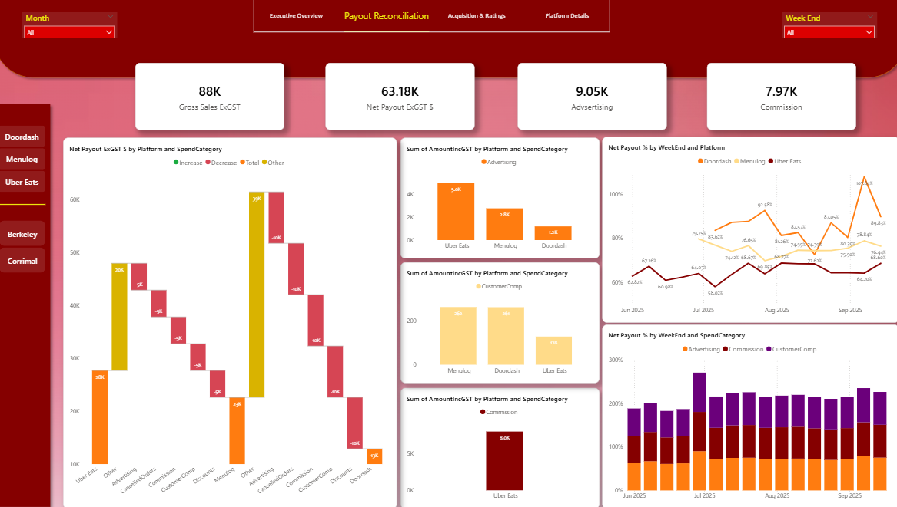

# 🍳 Power BI Data Model — Food Delivery Analytics


This Power BI project provides an **end-to-end data model** and **executive dashboards** for analyzing performance across **food delivery platforms** — **Menulog**, **Uber Eats**, and **Doordash** — with detailed payout, sales, and performance insights.

---

## 📊 Dashboards

### Executive Overview

- **Net Sales Ex-GST**, **Net Payout**, and **AOV**
- Week-over-week trends for Sales, Payout, Conversion %, and AOV
- KPIs vs prior 4-week averages

### Payout Reconciliation

- Breakdown by **Spend Category** (Advertising, Commission, Customer Compensation)
- Trend of **Net Payout % by WeekEnd**
- **Waterfall and bar visualizations** for reconciliation

---

## 🧠 Data Model Overview

The model follows a **Star Schema** with centralized Fact tables and supporting Dimension tables.

### Key Fact Tables
| Fact Table | Sources | Description |
|-------------|----------|-------------|
| **Fact_Payouts** | MLInvoices, DDPayoutsStd, UberPayoutsStd | Payout transactions |
| **Fact_Sales** | MLOrdersStd, DDSalesStd, UberPayoutsStd | Sales data per platform |
| **Fact_New_Cust** | MLAnalyticsTotalStd, UberCustGroupsStd, DDCustomersStd | New customer data |
| **Fact_Conversion** | MLAnalyticsTotalStd, UberFunnelStd | Conversion funnel |
| **Fact_Reviews** | UberReviewsStd, MLAnalyticsTotalStd, DDCustomersStd | Customer review ratings |
| **Fact_Expenses** | MLExpensesStd, DDExpensesStd, UberExpensesStd | Advertising, commission, and compensation costs |

### Key Dimension Tables
- **DimStore**
- **DimPlatform**
- **DimWeek**
- **Dim_SpendCategory**

---

## ⚙️ Standardization Rules

### Store × Platform × WeekEnd
- **WeekEnd** standardized to **Sunday (AEST)**  
- **Platform Names:** Menulog, Uber Eats, Doordash

**Example Values:**
```
TotalSalesInclGST = 1011.65
NetPayoutIncGST   = 570.23
```

---

## 🔁 M Query Tutorials & Techniques

### 1. Combine (Append) Multiple Tables
```m
Fact_Payouts = Table.Combine({MLInvoices, DDPayoutsStd, UberPayoutsStd})
```

### 2. Unpivot Columns
```
Select columns → Transform → Unpivot Columns
```

### 3. Group By Example
```
Home → Group By → WeekEnd, StoreName, Platform
```

### 4. Add Custom Column (Conditional)
```m
if Text.Contains([Store Name], "Berkeley", Comparer.OrdinalIgnoreCase)
then "Berkeley"
else "Corrimal"
```

### 5. Convert Currency Columns
```
Convert to text → Replace “$” → Change type to Decimal
```

### 6. Reference Queries
```
Right-click on query → Reference
```

---

## 📅 WeekEnd Function (Sydney Time)

```m
= (dt as any, optional firstDay as number) as date =>
let
    _dt      = try DateTime.From(dt) otherwise DateTime.From(Date.From(dt) & #time(0,0,0)),
    _date    = Date.From(_dt),
    _first   = if firstDay = null then Day.Monday else firstDay,
    WeekEnd  = Date.EndOfWeek(_date, _first)
in
    WeekEnd
```

### AEST Version
```m
fnWeekEndAEST = (dt as any) as date =>
let
    _dt = try DateTime.From(dt) otherwise DateTime.From(Date.From(dt) & #time(0,0,0)),
    _dtSydney = DateTimeZone.SwitchZone(DateTimeZone.From(_dt), 10),
    _dateSydney = Date.From(_dtSydney),
    WeekEnd = Date.EndOfWeek(_dateSydney, Day.Sunday)
in
    WeekEnd
```

---

## 🧮 Custom Column Examples

### Conversion Rate
```m
if [Viewed your menu] = null or [Viewed your menu] = 0 
then null 
else Number.From([Placed an order]) / Number.From([Viewed your menu])
```

### Average Rating
```m
(
    1 * [Count 1 Star] +
    2 * [Count 2 Star] +
    3 * [Count 3 Star] +
    4 * [Count 4 Star] +
    5 * [Count 5 Star]
)
/
(
    [Count 1 Star] +
    [Count 2 Star] +
    [Count 3 Star] +
    [Count 4 Star] +
    [Count 5 Star]
)
```

### Spend Category Classification
```m
each if Text.Contains([Attribute], "AdSpend") then "Advertising"
else if Text.Contains([Attribute], "Service") then "Commission"
else if Text.Contains([Attribute], "Refund") then "CustomerComp"
else if Text.Contains([Attribute], "Discount") then "Discounts"
else "Other"
```

---

## 🧩 Data Quality Profiling

Create a **profiling function** for null %, distinct count, and type checks.

```m
// fxProfileTable(table as table, optional TableName as text)
(table as table, optional TableName as text) as table =>
let
    TotalRows = Table.RowCount(table),
    ColNames = Table.ColumnNames(table),
    GetColStats = (colName as text) as record =>
        let
            col = Table.Column(table, colName),
            nonNull = List.RemoveNulls(col),
            nullCount = List.Count(List.Select(col, each _ = null)),
            distinctCount = List.Count(List.Distinct(col))
        in
            [ColumnName = colName, NullCount = nullCount, DistinctCount = distinctCount],
    ColStatsList = List.Transform(ColNames, each GetColStats(_)),
    ColStatsTable = Table.FromRecords(ColStatsList)
in
    ColStatsTable
```

Then call it:
```m
= fxProfileTable(UberPayoutsSTD, "UberPayoutsSTD")
```

Append all results into:
```
DQ_Profile_AllTables
```

---

## 🧾 Highlights

- 🔄 Unified multi-platform data model (Menulog, Uber Eats, Doordash)
- 🧩 Automated column profiling for data quality
- 📆 Dynamic week-ending date function (AEST)
- 💡 M Query patterns for merging, grouping, and categorization
- 📈 Power BI dashboards for **Executive KPIs** and **Payout Analysis**

---

---

## 🧑‍💻 Author
**Joseph Villarin**  
📍Philippines  
Data Enthusiast | Power BI Developer | Python & SQL Learner  
